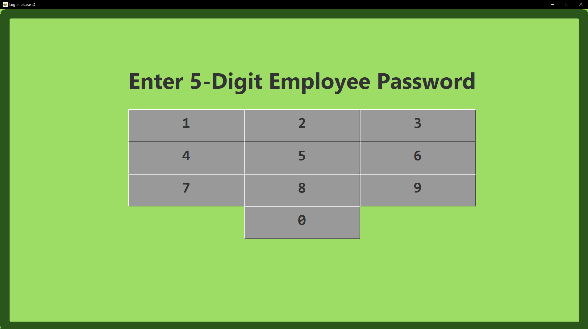
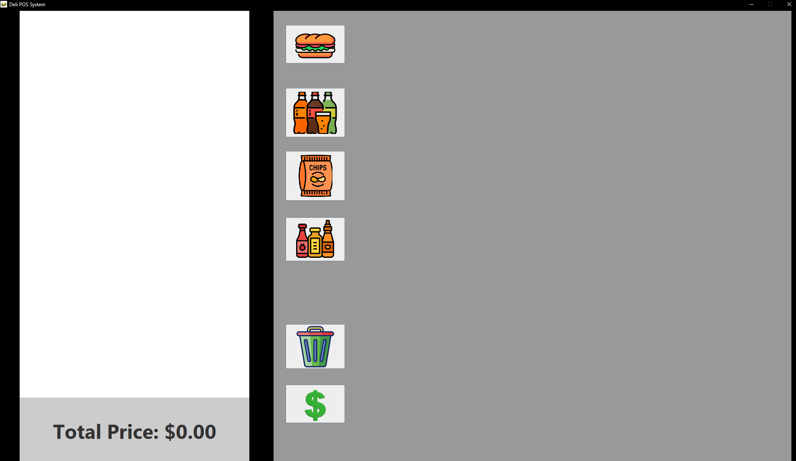
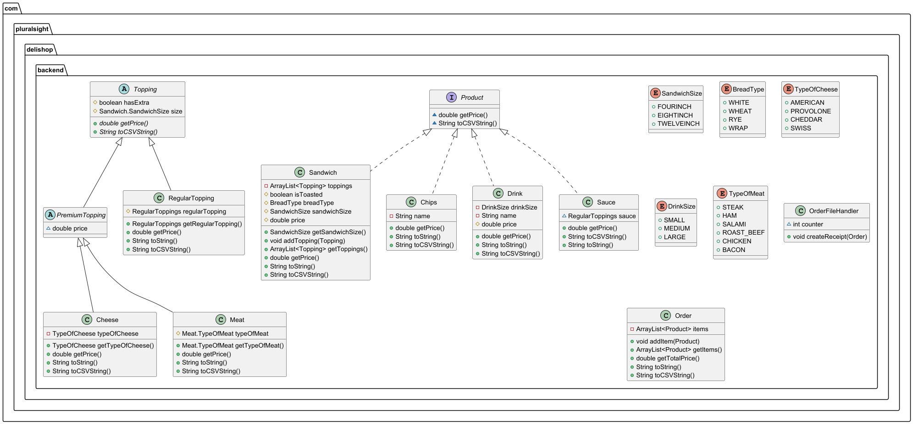

# Deli-Shop Capstone

## Description
 This project is made for a sandwich deli-shop, It was imagined to be used when a employee would enter a customers order
and then could print out a receipt for later use. Included is a structure of each menu item as well as a GUI to make for
easy use. This project was definitely challenging, especially for the fact that I have never created a GUI in java before
learning the Swing toolkit and using netbeans was about the only way that I made it through this project. There are two 
parts of the GUI the password screen as well as the main screen where employee's can enter the order.

## Password Screen

Both the login screen and the main screen are not resizable. Only being used for a POS system with the sizes of 1920x1080
windows. In the password screen the user has to enter they're employee ID password, which in this case is "12345". If the 
user enters the wrong password an error will show up and prompt them to enter the correct password.

## User Screen

The main screen has 6 immediate buttons. From top to bottom are the Sandwich, Drink, Chips, Sauce, Delete Order, and 
checkout button. The first 4 have each individual screens where the user can input the type that they want. the last 2 
clears the order and prints the order to a receipt in the receipt folder. 

## UML Diagram

This is the UML for the creations of each product item. I want to highlight the fact the interface product that is used 
in each class that will show up in the order. Also, the fact that Topping is not a subclass to sandwich. In my head it 
doesn't make sense to sell toppings by themselves, so they will not be able to order it by themselves. the Enums on the right
are nested Enums to make some less cluttered class structures since their relativity simple. OrderFileHandler is specifically 
for making printable receipt files and adding them to the folder.

## Author 
Jacob :)